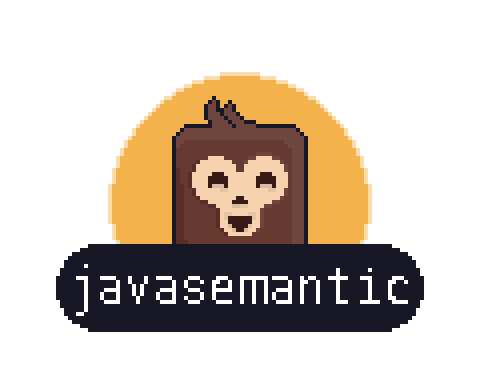

 [](LICENSE) [](.github/CONTRIBUTING.md)
<br>
Project aiming to automate semantic versioning via conventional commits on java projects using git hooks.


### javasemantic-maven-plugin
This is the Maven plugin for javasemantic.

You can enable javasemantic on your project by adding the plugin to your `pom.xml` (see comments for details/options):

```xml
      <!-- Versioning -->
      <plugin>
        <groupId>io.github.javasemantic</groupId>
        <artifactId>javasemantic-maven-plugin</artifactId>
        <!-- Please use latest release available from maven central -->
        <version>0.6.4</version>
        <!-- Configuration for how versioning should work -->
        <configuration>
          <!-- Activate the use of an static version instead of calculating it -->
          <activate-override-version>false</activate-override-version>
          <!-- Specify override value to use, default value is 0.0.1-SNAPSHOT -->
          <override-static-version>0.0.5-SNAPSHOT</override-static-version>
          <!-- Specify string value found in branch name of which the override value should not be used -->
          <override-version-branch-blacklist-items>
            <override-version-branch-blacklist-item>main</override-version-branch-blacklist-item>
            <override-version-branch-blacklist-item>release</override-version-branch-blacklist-item>
          </override-version-branch-blacklist-items>
        </configuration>
        <executions>
          <!-- On initialise phase this plugin will install the hooks required for javasemantic to work -->
          <execution>
            <id>install-hook</id>
            <goals>
              <goal>install-hooks</goal>
            </goals>
          </execution>
        </executions>
      </plugin>
      <!-- -->
```
